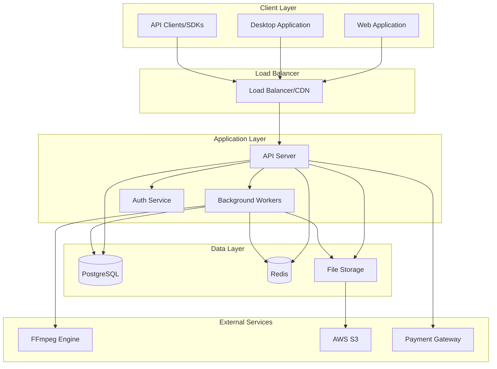
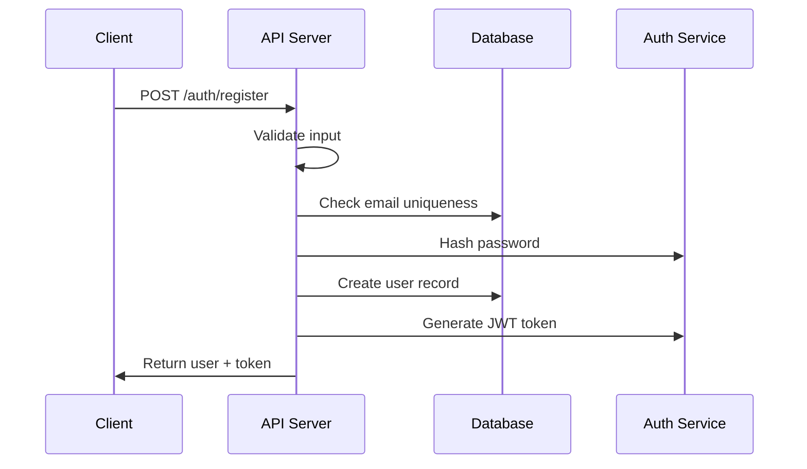
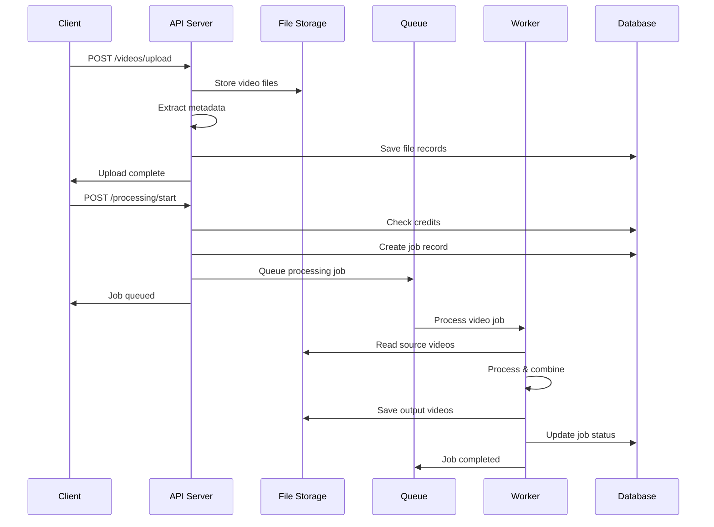
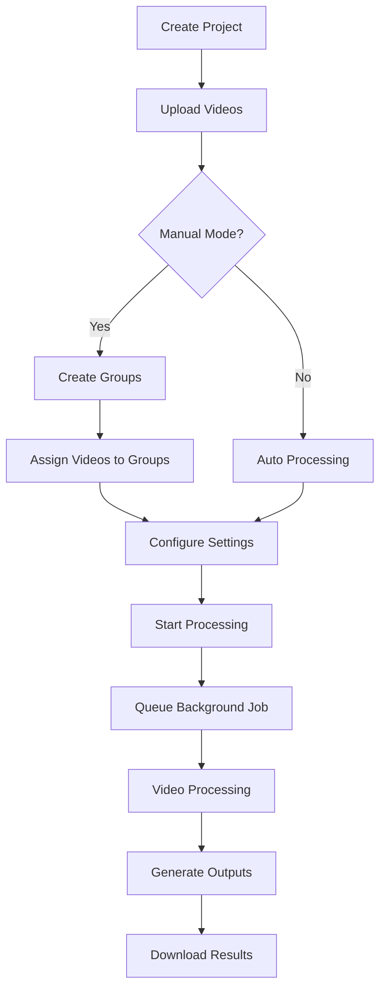

# System Architecture Documentation

## Overview

Video Mixer Pro is designed as a hybrid SaaS platform with a modular, scalable architecture that supports both web-based project management and local video processing. The system follows microservices principles while maintaining simplicity for startup-scale operations.

## High-Level Architecture



## Component Architecture

### 1. API Server (Express.js)

The main application server handling HTTP requests and business logic.

```
API Server
├── Controllers/          # HTTP request handlers
├── Services/            # Business logic layer
├── Middleware/          # Authentication, validation, logging
├── Routes/             # API endpoint definitions
└── Utils/              # Helper functions and utilities
```

#### Core Components:

**Controllers**: Handle HTTP requests and responses
```typescript
// Example: AuthController structure
class AuthController {
  async register(req: Request, res: Response): Promise<void>
  async login(req: Request, res: Response): Promise<void>
  async verifyLicense(req: Request, res: Response): Promise<void>
}
```

**Services**: Encapsulate business logic
```typescript
// Example: VideoService structure
class VideoService {
  async extractMetadata(videoPath: string): Promise<VideoMetadata>
  async validateVideo(videoPath: string): Promise<boolean>
  async generateThumbnail(videoPath: string): Promise<string>
}
```

**Middleware**: Cross-cutting concerns
- Authentication & Authorization
- Request Validation
- Error Handling
- Logging
- Rate Limiting

### 2. Background Workers

Asynchronous job processing for video operations.

```
Workers
├── Video Processing Worker
├── Notification Worker
├── Cleanup Worker
└── Analytics Worker
```

#### Video Processing Worker

```typescript
class VideoProcessingWorker {
  // Queue management
  async queueJob(jobData: ProcessingJobData): Promise<string>

  // Processing logic
  async processAutoMixing(project: Project): Promise<string[]>
  async processManualMixing(project: Project): Promise<string[]>

  // Video operations
  async combineVideos(videos: VideoFile[], settings: MixingSettings): Promise<string>
  async embedMetadata(videoPath: string, metadata: object): Promise<void>
}
```

### 3. Database Layer

#### PostgreSQL Schema Design

```sql
-- Core entities with relationships
Users (1) -----> (N) Projects
Projects (1) --> (N) VideoFiles
Projects (1) --> (N) VideoGroups
Projects (1) --> (N) ProcessingJobs
ProcessingJobs (1) --> (N) OutputFiles
Users (1) -----> (N) CreditTransactions
```

#### Data Access Patterns

```typescript
// Repository pattern with Prisma
interface ProjectRepository {
  findByUser(userId: string): Promise<Project[]>
  create(data: CreateProjectData): Promise<Project>
  update(id: string, data: UpdateProjectData): Promise<Project>
  delete(id: string): Promise<void>
}
```

### 4. File Storage Architecture

```
File Storage
├── Uploads/            # Temporary user uploads
│   ├── videos/         # Raw video files
│   └── thumbnails/     # Generated thumbnails
├── Processing/         # Temporary processing files
└── Outputs/           # Final processed videos
    ├── projects/      # Organized by project
    └── downloads/     # Ready for download
```

#### Storage Strategies

**Local Development**:
```
uploads/
├── 1234567890_video1.mp4
├── 1234567891_video2.mp4
└── thumbnails/
    ├── 1234567890_thumb.jpg
    └── 1234567891_thumb.jpg
```

**Production (AWS S3)**:
```
s3://videomixpro-storage/
├── users/{userId}/
│   ├── uploads/{projectId}/
│   ├── processing/{jobId}/
│   └── outputs/{jobId}/
└── system/
    ├── templates/
    └── assets/
```

## Data Flow Architecture

### 1. User Registration & Authentication



### 2. Video Upload & Processing



### 3. Project Management Flow



## Security Architecture

### 1. Authentication & Authorization

```typescript
// JWT-based authentication
interface AuthTokenPayload {
  userId: string
  email: string
  licenseType: LicenseType
  iat: number
  exp: number
}

// License verification for desktop app
interface LicenseVerification {
  licenseKey: string
  machineId: string
  appVersion: string
  timestamp: string
  signature: string  // HMAC signature
}
```

### 2. API Security Layers

```
Client Request
    ↓
Rate Limiting (Redis)
    ↓
CORS Validation
    ↓
Authentication (JWT)
    ↓
Authorization (Role-based)
    ↓
Input Validation (Zod)
    ↓
Business Logic
    ↓
Database Access
```

### 3. File Security

```typescript
// File validation pipeline
class FileValidator {
  validateFileType(mimetype: string): boolean
  validateFileSize(size: number): boolean
  validateVideoContent(buffer: Buffer): boolean
  sanitizeFileName(filename: string): string
}
```

## Scalability Design

### 1. Horizontal Scaling Points

**API Servers**: Stateless design allows multiple instances
```
Load Balancer
├── API Server 1
├── API Server 2
└── API Server N
```

**Background Workers**: Independent worker processes
```
Redis Queue
├── Video Worker 1
├── Video Worker 2
└── Video Worker N
```

**Database**: Read replicas and connection pooling
```
Write DB (Primary)
├── Read Replica 1
├── Read Replica 2
└── Read Replica N
```

### 2. Performance Optimization

#### Caching Strategy

```typescript
// Multi-level caching
interface CacheStrategy {
  // Level 1: In-memory (API server)
  memoryCache: Map<string, any>

  // Level 2: Redis (shared)
  redisCache: Redis

  // Level 3: CDN (static assets)
  cdnCache: CloudFront
}
```

#### Database Optimization

```sql
-- Strategic indexes for performance
CREATE INDEX CONCURRENTLY projects_user_id_created_at_idx
ON projects(user_id, created_at DESC);

CREATE INDEX CONCURRENTLY processing_jobs_status_idx
ON processing_jobs(status)
WHERE status IN ('PENDING', 'PROCESSING');
```

### 3. Queue Architecture

```typescript
// Bull Queue configuration
interface QueueConfiguration {
  videoProcessing: {
    concurrency: 3,           // Max 3 concurrent video jobs
    attempts: 3,              // Retry failed jobs 3 times
    backoff: 'exponential',   // Exponential backoff
    removeOnComplete: 10,     // Keep last 10 completed jobs
    removeOnFail: 50         // Keep last 50 failed jobs
  },

  notifications: {
    concurrency: 10,          // High concurrency for notifications
    attempts: 2,
    delay: 1000              // 1 second delay
  }
}
```

## Integration Points

### 1. Desktop Application Integration

```typescript
// License verification API
interface DesktopIntegration {
  verifyLicense(request: LicenseRequest): Promise<LicenseResponse>
  downloadProject(projectId: string): Promise<ProjectData>
  uploadResults(projectId: string, results: ProcessedVideos): Promise<void>
}
```

### 2. External Service Integration

**Payment Processing**:
```typescript
interface PaymentGateway {
  createPaymentIntent(amount: number): Promise<PaymentIntent>
  handleWebhook(payload: WebhookData): Promise<void>
  refundPayment(paymentId: string): Promise<RefundResult>
}
```

**Cloud Storage**:
```typescript
interface StorageProvider {
  uploadFile(file: Buffer, key: string): Promise<string>
  downloadFile(key: string): Promise<Buffer>
  generatePresignedUrl(key: string): Promise<string>
  deleteFile(key: string): Promise<void>
}
```

### 3. Monitoring & Observability

```typescript
// Comprehensive monitoring setup
interface MonitoringStack {
  // Application metrics
  prometheus: PrometheusMetrics

  // Centralized logging
  winston: WinstonLogger

  // Error tracking
  sentry: SentryErrorTracking

  // Performance monitoring
  newrelic: NewRelicAPM

  // Health checks
  healthChecks: HealthCheckEndpoints
}
```

## Deployment Architecture

### 1. Container Strategy

```dockerfile
# Multi-stage build for optimization
FROM node:18-alpine AS builder
# Build application

FROM node:18-alpine AS production
# Runtime environment
```

### 2. Infrastructure Components

```yaml
# Docker Compose for local development
version: '3.8'
services:
  api:
    build: .
    ports: [3000:3000]
    depends_on: [postgres, redis]

  workers:
    build: .
    command: npm run queue:dev
    depends_on: [postgres, redis]

  postgres:
    image: postgres:15-alpine
    volumes: [postgres_data:/var/lib/postgresql/data]

  redis:
    image: redis:7-alpine
    volumes: [redis_data:/data]
```

### 3. Production Deployment

```yaml
# Kubernetes deployment example
apiVersion: apps/v1
kind: Deployment
metadata:
  name: videomixpro-api
spec:
  replicas: 3
  selector:
    matchLabels:
      app: videomixpro-api
  template:
    spec:
      containers:
      - name: api
        image: videomixpro:latest
        ports:
        - containerPort: 3000
        env:
        - name: DATABASE_URL
          valueFrom:
            secretKeyRef:
              name: db-credentials
              key: url
```

## Error Handling & Recovery

### 1. Error Classification

```typescript
// Structured error hierarchy
abstract class BaseError extends Error {
  abstract statusCode: number
  abstract code: string
}

class ValidationError extends BaseError {
  statusCode = 422
  code = 'VALIDATION_ERROR'
}

class VideoProcessingError extends BaseError {
  statusCode = 500
  code = 'PROCESSING_ERROR'
}
```

### 2. Recovery Strategies

**Database Failures**:
- Connection pooling with retry logic
- Read replica fallback
- Circuit breaker pattern

**File Storage Failures**:
- Multi-region backup
- Retry with exponential backoff
- Graceful degradation

**Processing Failures**:
- Job retry mechanism
- Dead letter queue
- Manual intervention alerts

## Future Scalability Considerations

### 1. Microservices Migration Path

```
Current Monolith → Modular Monolith → Microservices

Phase 1: Extract video processing service
Phase 2: Extract authentication service
Phase 3: Extract file management service
Phase 4: Extract notification service
```

### 2. Event-Driven Architecture

```typescript
// Event sourcing for future implementation
interface DomainEvent {
  eventId: string
  eventType: string
  aggregateId: string
  timestamp: Date
  payload: object
}

// Example events
type VideoUploadedEvent = DomainEvent & {
  eventType: 'VideoUploaded'
  payload: { projectId: string, videoId: string, metadata: VideoMetadata }
}

type ProcessingCompletedEvent = DomainEvent & {
  eventType: 'ProcessingCompleted'
  payload: { jobId: string, outputFiles: string[] }
}
```

### 3. Multi-Tenant Architecture

```typescript
// Tenant isolation strategies
interface TenantStrategy {
  // Row-level security
  rowLevelSecurity: PostgreSQLRLS

  // Schema-per-tenant
  schemaIsolation: MultiSchemaDB

  // Database-per-tenant
  databaseIsolation: MultiTenantDB
}
```

This architecture provides a solid foundation for Video Mixer Pro while maintaining flexibility for future growth and feature additions.